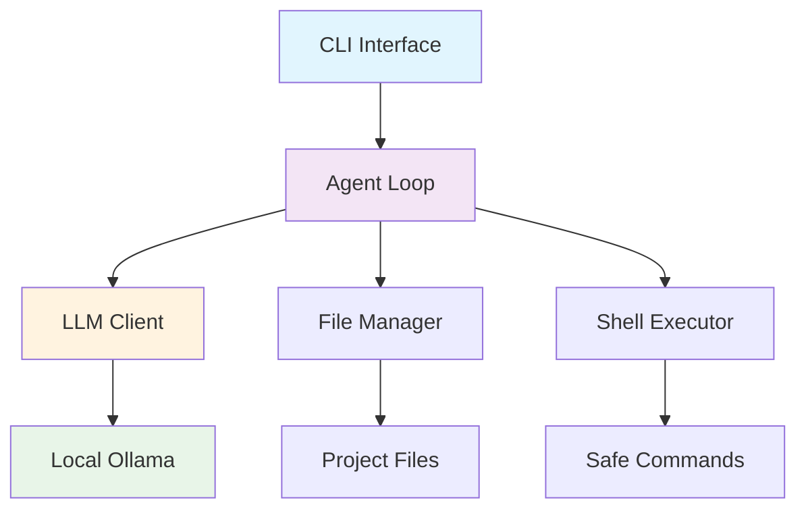

<div align="center">

# 🤖 Simpleton CLI
### *Your Local AI-Powered Coding Companion*

[](https://nodejs.org/)
[](https://www.typescriptlang.org/)
[](LICENSE)
[](https://github.com/AfyKirby1/Simpleton-CLI/stargazers)

**100% Local** • **No API Keys** • **Complete Privacy** • **Instant Setup**

[🚀 Quick Start](#-quick-start) • [📖 Documentation](docs/) • [💡 Examples](docs/EXAMPLES.md) • [🛠️ Contributing](docs/CONTRIBUTING.md)

</div>

---

## 🌟 Why Simpleton CLI?

<table>
<tr>
<td width="50%">

### 🔒 **Complete Privacy**
- **100% Local execution** - Your code never leaves your machine
- **No API keys required** - Works entirely offline
- **Zero cloud dependencies** - Perfect for enterprise environments

### 🚀 **Instant Productivity** 
- **One-click setup** - Get coding with AI in minutes
- **Smart context awareness** - Understands your entire project
- **Interactive chat mode** - Natural conversation with your AI

</td>
<td width="50%">

### 🧠 **Powerful AI Integration**
- **Multiple LLM support** - Ollama, LiteLLM, OpenAI-compatible
- **Advanced model management** - Easy switching between models
- **Intelligent fallbacks** - Auto-recovery when models aren't available

### 🛡️ **Safe & Controlled**
- **Sandboxed execution** - Commands run safely in isolated environments
- **Approval prompts** - You control every action
- **Beautiful diffs** - See exactly what changes before applying

</td>
</tr>
</table>

---

## 🎬 See It In Action

<div align="center">

### 💬 Interactive Chat Mode
```bash
🤖 AI CLI Agent starting...
📁 Project: my-awesome-app
🔗 Endpoint: http://localhost:11434/v1
🧠 Model: mistral:7b

💭 You: Create a React component for user authentication

🤖 AI: I'll help you create a comprehensive authentication component...
```

### 🔧 Smart Code Generation
```bash
ai-cli "add error handling to my API routes"
```
```diff
+ try {
+   const user = await User.findById(req.params.id);
+   if (!user) {
+     return res.status(404).json({ error: 'User not found' });
+   }
    res.json(user);
+ } catch (error) {
+   console.error('Error fetching user:', error);
+   res.status(500).json({ error: 'Internal server error' });
+ }
```

</div>

---

## ✨ Features That Set Us Apart

<div align="center">
<table>
<tr>
<td align="center" width="25%">

<br><strong>100% Local</strong>
<br><small>No data leaves your machine</small>
</td>
<td align="center" width="25%">

<br><strong>Smart AI</strong>
<br><small>Context-aware coding assistant</small>
</td>
<td align="center" width="25%">

<br><strong>Lightning Fast</strong>
<br><small>Instant responses, no delays</small>
</td>
<td align="center" width="25%">

<br><strong>Secure</strong>
<br><small>Sandboxed execution</small>
</td>
</tr>
</table>
</div>

### 🎯 Core Features

- **🧠 Advanced Model Management** - Interactive selection from curated model lists
- **📁 Project Context Awareness** - Auto-indexes your project files and git status  
- **💬 Interactive Chat Mode** - REPL-style conversation with streaming responses
- **🔧 Multiple Execution Modes** - Suggest, auto-edit, or full-auto modes
- **🛡️ Safe Execution** - Sandboxed shell commands with approval prompts
- **📊 Beautiful Diffs** - Syntax-highlighted diffs for all file changes
- **⚙️ Flexible Configuration** - Easy setup with auto-detection
- **🎨 Rich Terminal UI** - Beautiful spinners, colors, and progress indicators
- **🔄 Intelligent Fallbacks** - Auto-recovery and helpful error messages
- **📈 Performance Monitoring** - Built-in benchmarking and optimization

---

## 🚀 Quick Start

### 📋 Prerequisites

<div align="center">
<table>
<tr>
<td align="center">

<br><strong>Node.js 22+</strong>
<br><a href="https://nodejs.org/">Download</a>
</td>
<td align="center">

<br><strong>Ollama</strong>
<br><a href="https://ollama.com/">Install</a>
</td>
</tr>
</table>
</div>

### ⚡ One-Click Installation (Windows)

```cmd
# Clone and auto-install everything
git clone https://github.com/AfyKirby1/Simpleton-CLI.git
cd Simpleton-CLI
install-windows.bat
```

### 🐧 Universal Installation

```bash
# Clone the repository
git clone https://github.com/AfyKirby1/Simpleton-CLI.git
cd Simpleton-CLI

# Install dependencies and build
npm install
npm run build

# Optional: Link globally
npm link
```

### 🎯 First Run

```bash
# Quick setup with AI model
ai-cli ollama --setup

# Start interactive chat
ai-cli chat

# Or give it a task
ai-cli "explain this code and suggest improvements"
```

---

## 🎮 Usage Examples

<details>
<summary><strong>🗣️ Interactive Chat Mode</strong></summary>

```bash
ai-cli chat
```
Perfect for exploratory conversations, code reviews, and iterative development.
</details>

<details>
<summary><strong>⚡ Quick Tasks</strong></summary>

```bash
# Generate code
ai-cli "create a REST API endpoint for user management"

# Debug issues  
ai-cli "fix the memory leak in this React component"

# Code review
ai-cli "review this function for security vulnerabilities"
```
</details>

<details>
<summary><strong>🔧 Smart Execution Modes</strong></summary>

```bash
# Suggest only (safe mode)
ai-cli --suggest "optimize this database query"

# Auto-edit with confirmation
ai-cli --auto-edit "add TypeScript types to this file"

# Full automation (use carefully!)
ai-cli --full-auto "fix all linting errors"
```
</details>

<details>
<summary><strong>🧠 Model Management</strong></summary>

```bash
# Interactive model selection
ai-cli ollama --select

# Quick setup with recommended model
ai-cli ollama --setup

# List available models
ai-cli model --list

# Switch models easily  
ai-cli model --switch
```
</details>

---

## 📁 Project Structure

```
Simpleton-CLI/
├── 📄 README.md                     # You are here!
├── 📄 LICENSE                       # MIT License
├── 📁 docs/                         # Complete documentation
│   ├── 📖 QUICK_START.md            # 5-minute setup guide
│   ├── 💡 EXAMPLES.md               # Usage examples
│   ├── 🏗️ ARCHITECTURE.md           # Technical deep-dive
│   ├── 🤝 CONTRIBUTING.md           # How to contribute
│   └── 🚀 DEPLOYMENT.md             # Advanced installation
├── 📁 src/                          # TypeScript source code
│   ├── 🤖 agent/                    # AI agent logic
│   ├── ⚙️ commands/                 # CLI commands
│   ├── 🔧 config/                   # Configuration management
│   ├── 🧠 llm/                      # LLM client integration
│   ├── 🛠️ tools/                    # File & shell operations
│   └── 🎨 ui/                       # User interface components
├── 🎯 install-windows.bat           # Windows auto-installer
└── 🚀 launch-ai-cli.bat             # Interactive launcher
```

---

## 🛠️ Advanced Configuration

<details>
<summary><strong>⚙️ Configuration Options</strong></summary>

```bash
# View current configuration
ai-cli config --list

# Set custom endpoint
ai-cli config --set endpoint http://localhost:11434/v1

# Configure model
ai-cli config --set model mistral:7b

# Auto-detect and configure everything
ai-cli setup
```
</details>

<details>
<summary><strong>🎯 Recommended Models</strong></summary>

| Model | Size | RAM | Use Case |
|-------|------|-----|----------|
| **mistral:7b** ⭐ | 4.1GB | 8GB+ | General coding (recommended) |
| **llama3.2:3b** | 2.0GB | 4GB+ | Lightweight coding |
| **qwen2.5-coder:7b** | 4.1GB | 8GB+ | Specialized coding |
| **codellama:7b** | 3.8GB | 8GB+ | Meta's code model |
| **stable-code:3b** | 1.6GB | 4GB+ | Efficient coding |

</details>

<details>
<summary><strong>📈 Performance Monitoring</strong></summary>

```bash
# View performance dashboard
ai-cli performance

# Run benchmarks
ai-cli performance --benchmark all

# Export metrics
ai-cli performance --export metrics.json
```
</details>

---

## 🏗️ Architecture Highlights

<div align="center">



</div>

- **🔄 Modular Design** - Clean separation of concerns
- **🛡️ Security First** - Sandboxed execution with approval prompts
- **⚡ Performance Optimized** - Caching, connection pooling, parallel processing
- **🧠 Smart Fallbacks** - Automatic model switching and error recovery
- **🎨 Beautiful UI** - Rich terminal interface with spinners and colors

---

## 🤝 Contributing

We love contributions! Check out our [Contributing Guide](docs/CONTRIBUTING.md) to get started.

<div align="center">

[](https://github.com/AfyKirby1/Simpleton-CLI/graphs/contributors)
[](https://github.com/AfyKirby1/Simpleton-CLI/issues)
[](https://github.com/AfyKirby1/Simpleton-CLI/pulls)

</div>

### 💡 Ways to Contribute

- 🐛 [Report bugs](https://github.com/AfyKirby1/Simpleton-CLI/issues/new?template=bug_report.md)
- 💡 [Request features](https://github.com/AfyKirby1/Simpleton-CLI/issues/new?template=feature_request.md)
- 📖 [Improve documentation](docs/)
- 🔧 [Submit pull requests](https://github.com/AfyKirby1/Simpleton-CLI/compare)
- ⭐ [Star this repo](https://github.com/AfyKirby1/Simpleton-CLI/stargazers) to show support!

---

## 📚 Documentation

- **[📖 Complete Documentation](docs/)** - Everything you need to know
- **[🚀 Quick Start Guide](docs/QUICK_START.md)** - Get running in 5 minutes
- **[💡 Examples & Tutorials](docs/EXAMPLES.md)** - Learn by doing
- **[🏗️ Architecture Guide](docs/ARCHITECTURE.md)** - Technical deep-dive
- **[🚀 Deployment Guide](docs/DEPLOYMENT.md)** - Advanced installation options
- **[📋 API Reference](docs/API.md)** - Complete API documentation

---

## 📄 License

This project is licensed under the MIT License - see the [LICENSE](LICENSE) file for details.

---

<div align="center">

### 🌟 Star Us on GitHub! 

If Simpleton CLI has helped you in your coding journey, please consider giving us a star ⭐

[](https://github.com/AfyKirby1/Simpleton-CLI/stargazers)

**Made with ❤️ by developers, for developers**

[🐛 Report Bug](https://github.com/AfyKirby1/Simpleton-CLI/issues) • [💡 Request Feature](https://github.com/AfyKirby1/Simpleton-CLI/issues) • [💬 Discussions](https://github.com/AfyKirby1/Simpleton-CLI/discussions)

</div> 