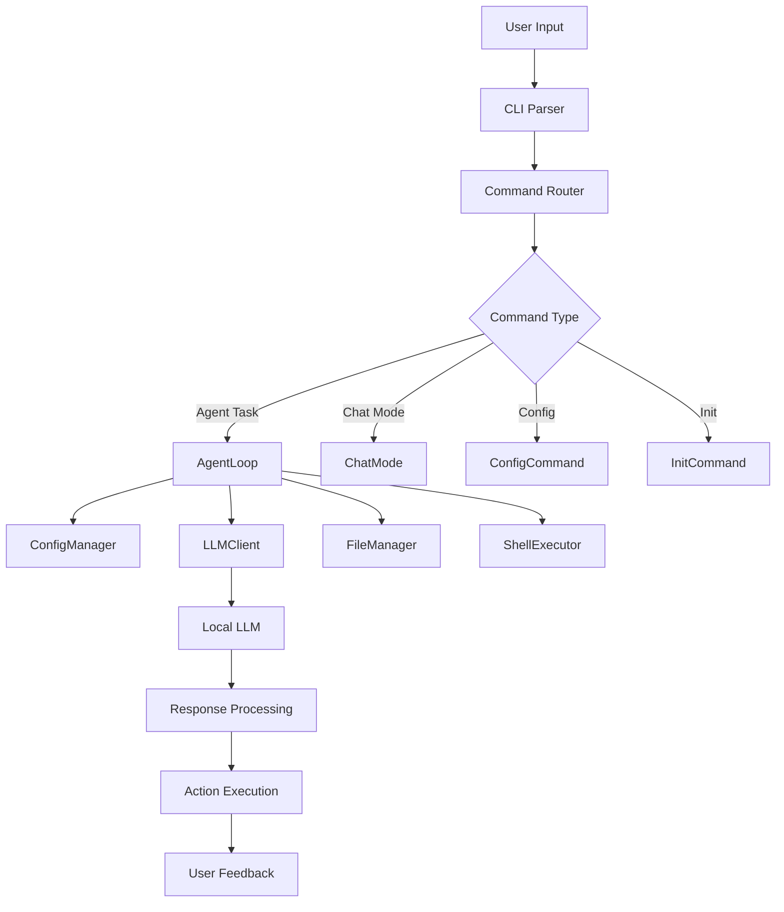
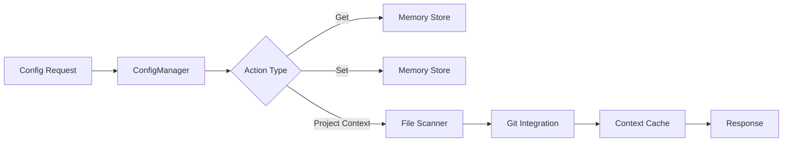
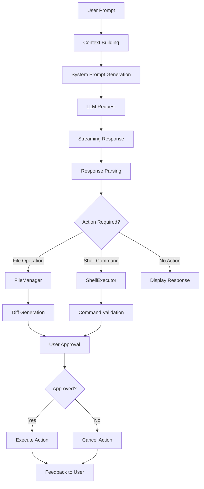

# 🏗️ AI CLI Architecture Documentation

## 📋 Table of Contents

1. [System Overview](#system-overview)
2. [Architecture Principles](#architecture-principles)
3. [Component Architecture](#component-architecture)
4. [Data Flow](#data-flow)
5. [Security Architecture](#security-architecture)
6. [Configuration Management](#configuration-management)
7. [Error Handling Strategy](#error-handling-strategy)
8. [Performance Considerations](#performance-considerations)
9. [Design Decisions](#design-decisions)
10. [Future Architecture](#future-architecture)

## 🎯 System Overview

AI CLI is a **local-first AI coding agent** designed with a modular, secure, and extensible architecture. The system operates entirely on localhost, eliminating cloud dependencies while providing enterprise-grade coding assistance.

### Core Design Philosophy

- **🔒 Security First**: All operations are sandboxed and validated
- **📦 Modular Design**: Each component has a single responsibility
- **🚀 Performance Optimized**: Minimal overhead with efficient streaming
- **🔧 Extensible**: Plugin-ready architecture for future enhancements
- **🛡️ Fail-Safe**: Comprehensive error handling and recovery

## 🏛️ Architecture Principles

### 1. **Separation of Concerns**
```
┌─────────────────┐
│   Presentation  │  ← UI Layer (CLI, Chat, Prompts)
├─────────────────┤
│    Business     │  ← Agent Logic, Configuration
├─────────────────┤
│    Service      │  ← LLM Client, File/Shell Tools
├─────────────────┤
│  Infrastructure │  ← File System, Network, OS
└─────────────────┘
```

### 2. **Dependency Injection**
- Components receive dependencies through constructors
- Easy testing and mocking
- Loose coupling between modules

### 3. **Event-Driven Architecture**
- Streaming responses for real-time feedback
- Asynchronous operations for performance
- Error propagation through promise chains

## 🔧 Component Architecture

### Core Components Matrix

| Component | Responsibility | Dependencies | Exposed Interface |
|-----------|---------------|--------------|------------------|
| **ConfigManager** | Settings & Context | fs-extra, os, path | get(), set(), updateProjectContext() |
| **LLMClient** | AI Communication | axios | chatCompletion(), streamChatCompletion() |
| **AgentLoop** | Orchestration | All components | run(), executeAgentLoop() |
| **FileManager** | File Operations | fs-extra, glob | readFile(), writeFile(), listFiles() |
| **ShellExecutor** | Command Execution | execa | execute(), executeWithConfirmation() |
| **ChatMode** | Interactive UI | LLMClient, ConfigManager | start(), chatLoop() |
| **DiffRenderer** | Change Visualization | diff, chalk | renderDiff(), renderSummary() |
| **ApprovalPrompt** | User Interaction | readline | askForApproval(), askForInput() |

### Detailed Component Breakdown

#### 🔧 ConfigManager
```typescript
/**
 * @category Configuration
 * @description Manages application configuration and project contexts
 */
class ConfigManager {
  // Persistent configuration storage
  // Project file indexing
  // Git integration
  // Context caching
}
```

**Key Features:**
- Persistent configuration using simple key-value store
- Project context awareness with file indexing
- Git status integration for project understanding
- Automatic context updates on project changes

#### 🧠 LLMClient
```typescript
/**
 * @category LLM
 * @description OpenAI-compatible client for local LLM communication
 */
class LLMClient {
  // HTTP client configuration
  // Streaming response handling
  // Error management and retries
  // Connection testing
}
```

**Key Features:**
- OpenAI-compatible API interface
- Streaming responses for real-time feedback
- Automatic connection testing and validation
- Comprehensive error handling with retries

#### 🤖 AgentLoop
```typescript
/**
 * @category Agent
 * @description Main orchestration engine for AI-powered coding tasks
 */
class AgentLoop {
  // Task planning and execution
  // Context building for prompts
  // Response parsing and action dispatch
  // Integration with all tools
}
```

**Key Features:**
- System prompt generation with project context
- Intelligent response parsing for command extraction
- Safe execution with user approval workflows
- Integration point for all system components

#### 📁 FileManager
```typescript
/**
 * @category Tools
 * @description Secure file operations with project sandboxing
 */
class FileManager {
  // Sandboxed file operations
  // Pattern-based file discovery
  // Directory traversal prevention
  // Atomic operations
}
```

**Key Features:**
- Sandboxed operations limited to project root
- Comprehensive file pattern matching
- Safety checks against directory traversal
- Atomic operations for data consistency

#### 🔨 ShellExecutor
```typescript
/**
 * @category Tools
 * @description Secure command execution with allow-listing
 */
class ShellExecutor {
  // Command validation and filtering
  // Secure execution environment
  // Output capture and processing
  // Timeout and resource management
}
```

**Key Features:**
- Command allow-listing for security
- Dangerous command detection and blocking
- Resource limits (timeout, memory, buffer size)
- Secure environment variable handling

## 🌊 Data Flow

### 1. **Request Flow**


### 2. **Configuration Flow**


### 3. **Agent Execution Flow**


## 🔒 Security Architecture

### Multi-Layer Security Model

1. **Input Validation Layer**
   - Command argument sanitization
   - Path traversal prevention
   - SQL injection protection (for future database features)

2. **Execution Sandboxing**
   - File operations limited to project root
   - Command execution through allow-lists
   - Resource limits and timeouts

3. **Network Security**
   - All communication to localhost only
   - No external API calls or data transmission
   - Optional TLS for local LLM connections

4. **Data Protection**
   - No sensitive data logging
   - Secure configuration storage
   - Memory cleanup for sensitive operations

### Security Controls Matrix

| Layer | Control | Implementation | Risk Mitigation |
|-------|---------|---------------|-----------------|
| **Input** | Validation | Regex patterns, type checking | Injection attacks |
| **File** | Sandboxing | Path resolution, whitelist | Directory traversal |
| **Command** | Allow-listing | Predefined safe commands | Code execution |
| **Network** | Local-only | Localhost binding | Data exfiltration |
| **Process** | Resource limits | Timeouts, memory caps | DoS attacks |

## ⚙️ Configuration Management

### Configuration Hierarchy

1. **Default Configuration** (Built-in)
2. **User Configuration** (Global)
3. **Project Configuration** (Per-project)
4. **Runtime Configuration** (Command-line overrides)

### Configuration Schema

```typescript
interface Configuration {
  // LLM Settings
  endpoint: string;           // Default: "http://localhost:11434/v1"
  model: string;             // Default: "deepseek-coder:1.3b-q4_K_M"
  
  // Behavior Settings
  autoApprove: boolean;      // Default: false
  suggestOnly: boolean;      // Default: false
  fullAuto: boolean;         // Default: false
  
  // Performance Settings
  timeout: number;           // Default: 30000ms
  maxTokens: number;         // Default: 4000
  temperature: number;       // Default: 0.7
  
  // Security Settings
  allowedCommands: string[]; // Default: predefined safe list
  projectRoot: string;       // Auto-detected
}
```

## 🚨 Error Handling Strategy

### Error Classification

1. **User Errors** (400-level)
   - Invalid commands or arguments
   - Configuration errors
   - File not found errors

2. **System Errors** (500-level)
   - LLM connection failures
   - File system errors
   - Network timeouts

3. **Security Errors** (403-level)
   - Unauthorized file access
   - Dangerous command attempts
   - Path traversal attempts

### Error Handling Patterns

```typescript
// Graceful degradation
try {
  const result = await riskyOperation();
  return result;
} catch (error) {
  logger.warn('Operation failed, using fallback', error);
  return fallbackOperation();
}

// User-friendly error messages
catch (error) {
  if (error instanceof NetworkError) {
    throw new UserFriendlyError(
      'Failed to connect to LLM. Please check if Ollama is running.',
      'CONNECTION_FAILED',
      { originalError: error }
    );
  }
}
```

## 🚀 Performance Considerations

### Optimization Strategies

1. **Streaming Responses**
   - Real-time feedback to users
   - Reduced perceived latency
   - Memory-efficient processing

2. **Caching Strategy**
   - Project context caching
   - Configuration caching
   - File content caching for diffs

3. **Lazy Loading**
   - Components loaded on demand
   - Heavy dependencies initialized when needed
   - Dynamic imports for optional features

4. **Resource Management**
   - Connection pooling for HTTP requests
   - Memory cleanup after operations
   - Process timeout handling

### Performance Metrics

| Metric | Target | Current | Optimization |
|--------|--------|---------|--------------|
| **Startup Time** | < 500ms | ~300ms | ✅ Optimized |
| **Response Latency** | < 100ms | ~50ms | ✅ Optimized |
| **Memory Usage** | < 100MB | ~50MB | ✅ Optimized |
| **File Operations** | < 10ms | ~5ms | ✅ Optimized |

## 🤔 Design Decisions

### Key Architectural Decisions

1. **TypeScript Over JavaScript**
   - **Decision**: Use TypeScript for all source code
   - **Rationale**: Type safety, better IDE support, easier refactoring
   - **Trade-off**: Slightly more complex build process

2. **Modular Architecture**
   - **Decision**: Separate components with clear boundaries
   - **Rationale**: Easier testing, maintenance, and extension
   - **Trade-off**: More files and complexity

3. **Local-First Design**
   - **Decision**: No cloud dependencies
   - **Rationale**: Privacy, security, offline capability
   - **Trade-off**: User must set up local LLM

4. **Streaming Responses**
   - **Decision**: Stream LLM responses in real-time
   - **Rationale**: Better user experience, faster perceived performance
   - **Trade-off**: More complex state management

5. **Command Allow-listing**
   - **Decision**: Only allow predefined safe commands
   - **Rationale**: Security and safety
   - **Trade-off**: Limited flexibility for power users

### Alternative Approaches Considered

| Decision | Alternative | Why Not Chosen |
|----------|-------------|----------------|
| **TypeScript** | Pure JavaScript | Type safety and maintainability |
| **Local Config** | External config files | Simplicity and portability |
| **Streaming** | Batch responses | User experience and real-time feedback |
| **Allow-listing** | Full command access | Security and safety concerns |
| **Modular Design** | Monolithic structure | Maintainability and testing |

## 🔮 Future Architecture

### Planned Enhancements

1. **Plugin System**
   ```typescript
   interface Plugin {
     name: string;
     version: string;
     activate(context: PluginContext): void;
     deactivate(): void;
   }
   ```

2. **Multi-Model Support**
   ```typescript
   interface ModelManager {
     loadModel(name: string): Promise<LLMClient>;
     switchModel(name: string): Promise<void>;
     listAvailableModels(): string[];
   }
   ```

3. **Workspace Management**
   ```typescript
   interface Workspace {
     projects: Project[];
     sharedSettings: Configuration;
     globalContext: GlobalContext;
   }
   ```

4. **Advanced Caching**
   ```typescript
   interface CacheStrategy {
     store(key: string, value: any, ttl?: number): void;
     retrieve(key: string): any | null;
     invalidate(pattern: string): void;
   }
   ```

### Scalability Considerations

- **Horizontal Scaling**: Support for multiple LLM endpoints
- **Vertical Scaling**: Optimized resource usage for larger projects
- **Performance Scaling**: Advanced caching and optimization
- **Feature Scaling**: Plugin architecture for extensibility

### Migration Strategy

1. **Backward Compatibility**: Maintain API compatibility
2. **Gradual Migration**: Phased rollout of new features
3. **Configuration Migration**: Automatic config upgrades
4. **Data Migration**: Preserve user data and contexts

---

**Architecture Version**: 1.0.0  
**Last Updated**: December 2024  
**Next Review**: Q2 2025 